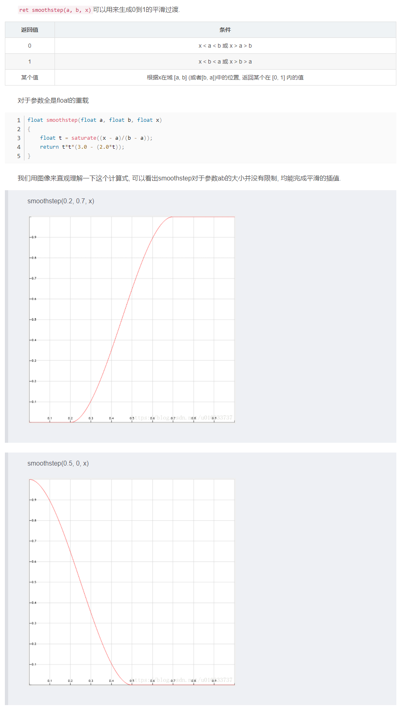

# [Smoothstep Node](https://docs.unity3d.com/Packages/com.unity.shadergraph@7.3/manual/Smoothstep-Node.html)

## Description
如果输入In的值分别在输入Edge1和Edge2的值之间，则返回0和1之间的平滑Hermite插值的结果。如果输入In的值小于输入Step1的值，则返回0；如果大于输入Step2的值，则返回1。

该节点与Lerp节点相似，但有两个显着差异。首先，用户使用该节点指定范围，返回值在0到1之间。这可以看作是Lerp Node的反义词。其次，此节点使用平滑的Hermite插值而不是线性插值。这意味着插值将从头开始逐渐加快，然后逐渐降低到结束。这对于创建看起来自然的动画，淡入淡出和其他过渡非常有用。

## Ports
|Name|Direction|Type|Description
|:---|:--------|:---|:-----
|Edge1|Input|Dynamic Vector|Minimum step value
|Edge2|Input|Dynamic Vector|Maximum step value
|In|Input|Dynamic Vector|Input value
|Out|Output|Dynamic Vector|Output value


## Generated Code Example
```h
void Unity_Smoothstep_float4(float4 Edge1, float4 Edge2, float4 In, out float4 Out)
{
    Out = smoothstep(Step1, Step2, In);
}
```

---
[smoothstep](https://docs.microsoft.com/zh-cn/windows/win32/direct3dhlsl/dx-graphics-hlsl-smoothstep) 函数说明  
[常用函数SmoothStep的实现原理](https://zhuanlan.zhihu.com/p/170493708)

---

|返回值|条件
|:-----|:---
|0|x < a < b 或 x > a > b
|1|x < b < a 或 x > b > a
|某个值|根据x在域 [a, b] (或者[b, a])中的位置, 返回某个在 [0, 1] 内的值

函数实现
```h
float smoothstep(float a, float b, float x)
{
    float t = saturate((x - a)/(b - a));
    return t*t*(3.0 - (2.0*t));
}
```

[smoothstep 原理](https://blog.csdn.net/u010333737/article/details/82859246)
