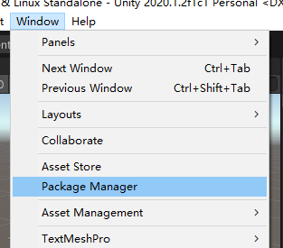
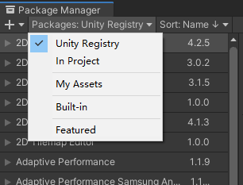
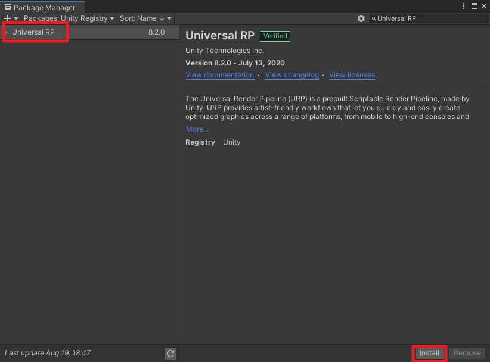
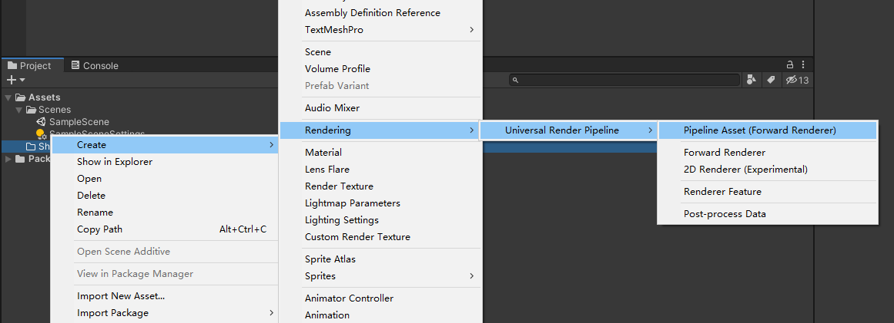
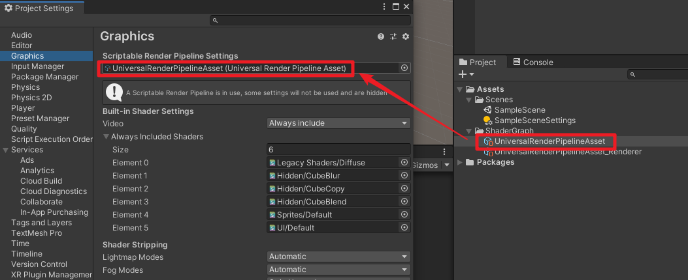

# 三、ShaderGraph使用前的环境准备
[1、安装Universal RP](#1安装universal-rp)  
[2、创建Pipeline Assets](#2创建pipeline-assets)  
[3、设置Pipeline Assets](#3设置pipeline-assets)  

首先除了安装ShaderGraph本身外，还得安装渲染管线工具，以URP渲染管线（工具包名叫Universal RP）为例。
## 1、安装Universal RP
点击菜单`Window - Package Manager`，打开`Package Manager`窗口。

点击`Packages`，选择`Unity Registry`，

然后搜索`Universal RP`，点击Install按钮，等等安装完毕。

## 2、创建Pipeline Assets
在`Project`窗口中`右键 - Create - Rendering - Universal Render Pipeline - Pipeline Asset (Forward Renderer)`，即可创建一个`Pipeline Assets`资源：`UniversalRenderPipelineAssets`。

## 3、设置Pipeline Assets
点击菜单 `Edit - Project Settings`，弹出`Project Settings`窗口，点击`Graphics`，将上面创建的`UniversalRenderPipelineAssets`拖到`Scriptable Render Pipeline Settings`中。

