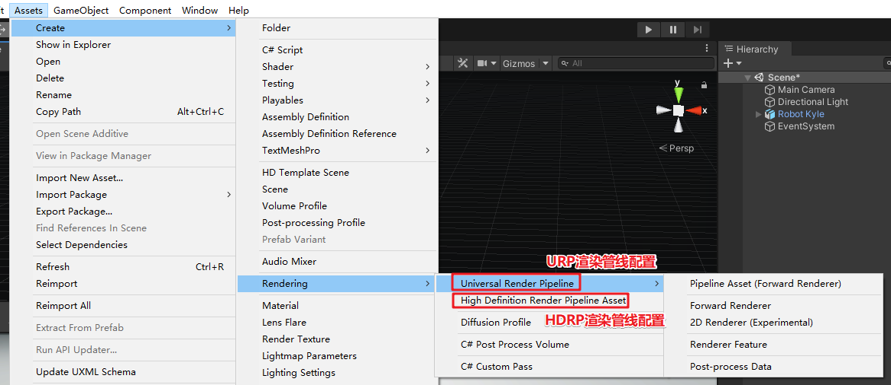
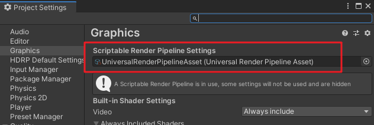
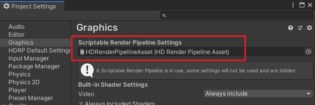
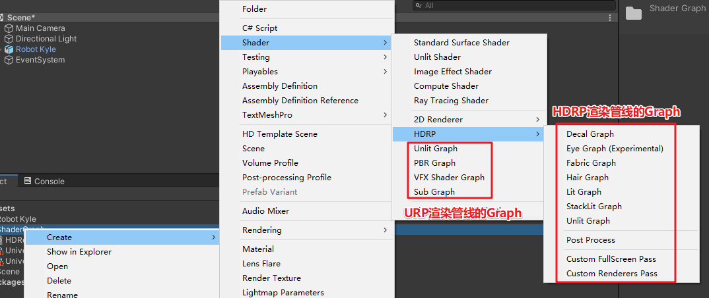
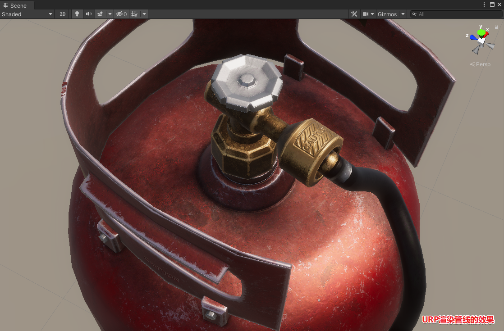
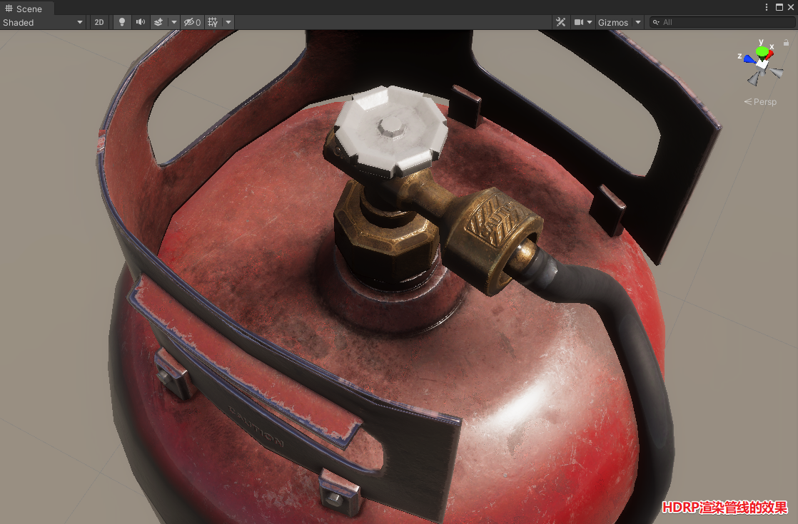

# 二、ShaderGraph科普
[1、渲染管线（Render Pipline）](#1渲染管线render-pipline)  
[2、可编程渲染管线，SRP（Scriptable Render Pipline）](#2可编程渲染管线srpscriptable-render-pipline)  
[3、高清渲染管线，HDRP（High Definition Render Pipleline）](#3高清渲染管线hdrphigh-definition-render-pipleline)  
[4、通用渲染管线，URP（Universal Render Pipleline）](#4通用渲染管线urpuniversal-render-pipleline)
[5、ShaderGraph](#5shadergraph)
[6、URP和HDRP效果对比](#6urp和hdrp效果对比)

## 1、渲染管线（Render Pipline）
渲染管线也称渲染流水线，是显示芯片（GPU）内部处理图形信号相互独立的并行的处理单位。  
渲染管线流程包括下面几个步骤：顶点处理、面处理、光栅化、像素处理等。  
Unity内置的渲染管线，我们可以使用shader来实现渲染管线中的某些步骤的逻辑。

## 2、可编程渲染管线，SRP（Scriptable Render Pipline）
Unity2018中引入了可编程渲染管线（Scriptable Render Pipline），简称SRP，是一种在Unity中通过C#脚本配置和执行渲染的方式。

为什么需要SRP?  
Unity内置的渲染管道只有Forward和Deferred两种。

    Forward Shading
    原理：每个作用于物体的像素光单独计算一次，drawCall随着物体与光照数量增加而成倍增加
    优点：不受硬件限制
    缺点：光照计算开销成倍增加随着光源和物体数量增加。
    每个物体接受光照数量有限。
---

    Deferred Shading
    原理：物体颜色、法线、材质等信息先渲染到G-Buffer中，光照最后单独渲染，避免每个物体多个光照批次的问题
    优点：作用于每个物体光照数量不再受到限制，光照计算不随着物体增加而增加
    缺点：移动设备需要支持OpenGL3.0。
    不支持MSAA。
    半透明物体仍然使用前向渲染。

如上，这两种内置的管道各有优缺点 ，还有，我们看不到源代码，如果为了表现某种特殊的视觉效果修改起来非常不便。所以就有了SRP的诞生。另外，根据项目的需求写合适的SRP，也可以降低DrawCall，提高运行效率。  
SRP引入了CommandBuffer。

    CommandBuffer，用于拓展Unity渲染管线。
    包含一系列渲染命令，比如设置渲染目标，绘制网格等，并可以设置为在摄像机期间的各个点执行渲染。

下面是CommandBuffer的一个简单的例子：（具体可看官方Github的例子，[传送门](https://github.com/stramit/SRPBlog/blob/master/SRP-Demo/Assets/SRP-Demo/1-BasicAssetPipe/BasicAssetPipe.cs)）

```c#
public override void Render(ScriptableRenderContext context, Camera[] cameras)
{
    base.Render(context, cameras);
    
    var cmd = new CommandBuffer();
    cmd.ClearRenderTarget(true, true, m_ClearColor);
    context.ExecuteCommandBuffer(cmd);
    cmd.Release();
    context.Submit();
}
```

`自己定制渲染管线对编程要求很高，难度大。`

所以Unity提供里2个预制的管线：高清渲染管线（HDRP，全称High Definition Render Pipleline）、通用渲染管线（URP，全称Universal Render Pipleline），注意，URP的前身就是轻量级渲染管线LWRP（全称Light Weight Render Pipleline）。

## 3、高清渲染管线，HDRP（High Definition Render Pipleline）
在Unity2018版本，Unity为了提高引擎的画面表现，推出了High Definition Render Pipeline，高清晰渲染管线，简称HDRP。
HDRP专注于高端图形渲染，针对高端硬件配置，像PC、XBox和Playstation，其面向高逼真度的游戏、图形demo和建筑渲染、超写实效果，以及所需的最佳图形效果，目前还不支持在手机移动端使用HDRP。
想得到HDRP的完美表现能力，需要大量的贴图，漫反射贴图、高光贴图、金属贴图、平滑贴图、AO贴图、法线贴图、凹凸贴图、高度贴图等等，所以要做HDRP流程需要非常长的时间和庞大的制作团队以及充足的预算。

## 4、通用渲染管线，URP（Universal Render Pipleline）
在2019.3版本中，Unity将轻量渲染管线LWRP重命名为通用渲染管线URP，通用渲染管线是制作精美图形和显示效果的强力方案，并且同时支持多个平台。轻量渲染管线设计初时具有快捷、可伸缩的优点，可为所有移动端带来高质量的图形效果。URP是Unity未来的默认渲染方式。
Unity官方将致力于改进通用渲染管线，为用户带来VFX Graph、Shader Graph、Custom Render Passes及最新Post-Processing的各种便利，实现等同甚至更好的品质与性能，且只需一次开发，便能在大量的平台上部署。

需要注意的是，通用渲染管线将不会取代或包括高清渲染管线（HDRP）。

## 5、ShaderGraph
Unity2018推出了一个可编程渲染管线工具ShaderGraph，让开发者们可以通过可视化界面拖拽来实现着色器的创建和编辑。
目前ShaderGraph支持的URP通用渲染管线，也支持HDRP高清渲染管线。
我们通过Unity的PackageManager安装ShaderGraph，还需要安装对应的渲染管线工具包，比如要使用URP通用渲染管线，则需要通过PackageManager安装Universal RP，如果要使用HDRP高清渲染管线，则需要通过PackageManager安装High Definition RP。
安装了渲染管线工具包之后，就可以通过菜单 Assets - Create - Rendering创建对应的渲染管线配置。



接着在`Editor - Project Setting - Graphics`中的`Scriptable Render Pipeline Settings`设置渲染管线配置文件。
如果是使用URP，则设置URP的渲染管线配置



如果是使用HDRP，则设置HDRP的渲染管线配置



然后，我们就可以创建对应的ShaderGraph，愉快得进行连连看了。




## 6、URP和HDRP效果对比
我实验了一下URP和HDRP的效果，感受一下  
先看URP的效果



再看HDRP的效果

