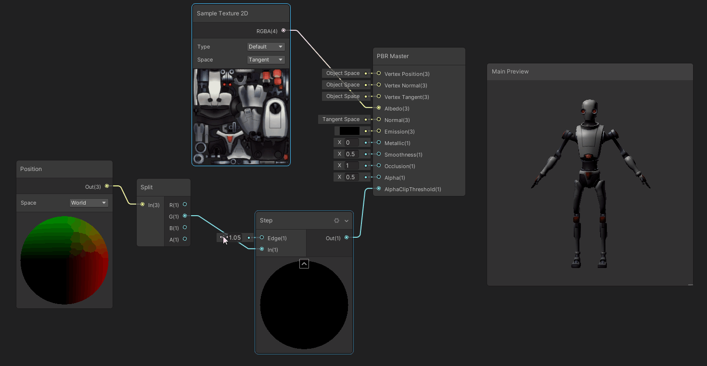
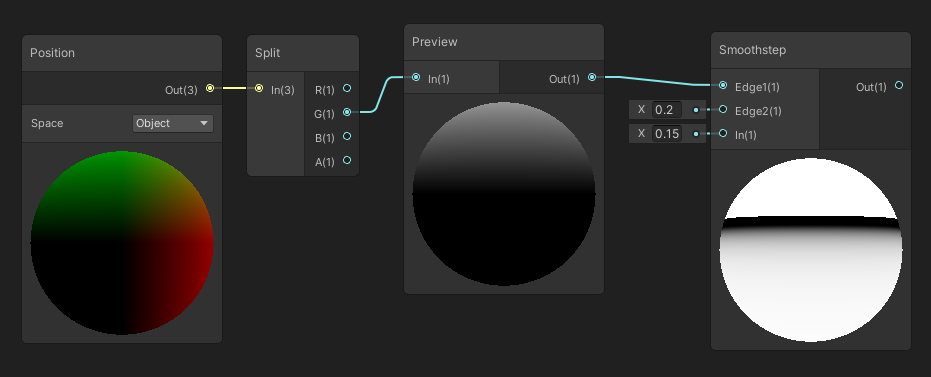

## 1、模型裁切，主要节点、Position、AlphaClip
原理：AlphaClip的值如果比Alpha的值大，则会不显示

### 备注

`进阶：在裁剪的基础上添加裁剪边缘光,首先利用Smoothstep做出一个边缘渐变
Smoothstep：如果输入In的值分别在输入Edge1和Edge2的值之间，则返回0和1之间的平滑Hermite插值的结果。如果输入In的值小于输入Step1的值，则返回0；如果大于输入Step2的值，则返回1 。`

然后将边缘渐变和颜色叠加，连到PBR Master的发光插槽Emission上

