## 18、高斯模糊
具体实现参见这篇文章：[Unity ShaderGraph实现图片的高斯模糊效果](https://linxinfa.blog.csdn.net/article/details/112252490)

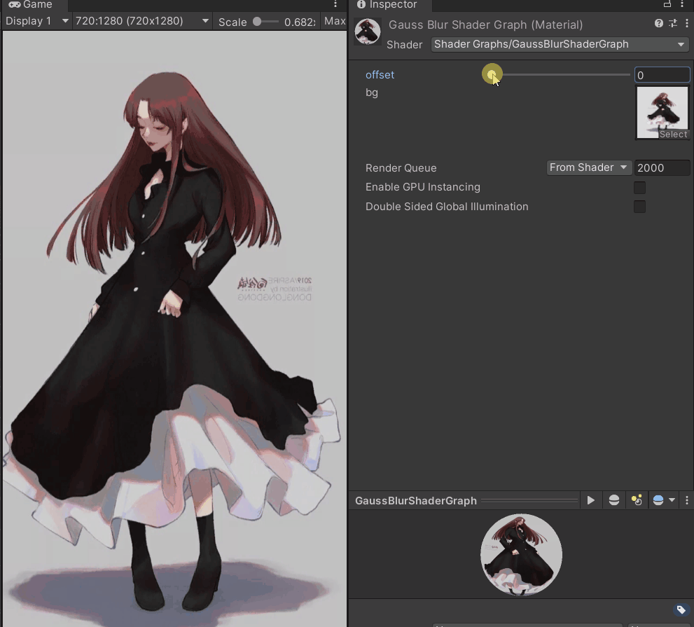

Demo工程已上传到[GitHub](https://github.com/linxinfa/UnityShaderGraphGaussBlurDemo)：

### **高斯模糊的原理**
对图片进行模糊处理，简单的思路为：把某一个像素的相邻像素和自身按照比例进行了混合，用新的值代替原像素。在处理像素的过程中，中、上下左右的比例如图  
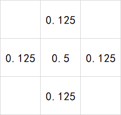


对应的算法如下：
```h
fixed4 color = tex2D (_MainTex, uv) * 0.5f;

color += tex2D(_MainTex,float2(uv.x - distance,uv.y)) * 0.125f;
color += tex2D(_MainTex,float2(uv.x + distance,uv.y)) * 0.125f;
color += tex2D(_MainTex,float2(uv.x,uv.y + distance)) * 0.125f;
color += tex2D(_MainTex,float2(uv.x,uv.y - distance)) * 0.125f;
```

高斯模糊是按以下的混合比例：  
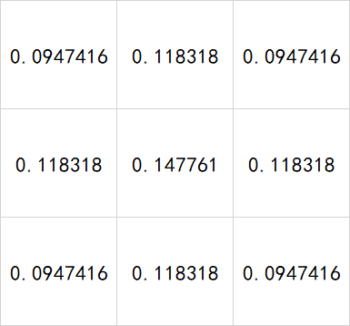

对应的算法如下：
```h
float _Blur;

fixed4 SampleSpriteTexture (float2 uv)
{
    // 1 / 16
    float offset = _Blur * 0.0625f;
    // 中
	fixed4 color = tex2D(_MainTex,float2(uv.x, uv.y)) * 0.147761f;
	
    // 左上
    color += tex2D(_MainTex, float2(uv.x - offset, uv.y - offset)) * 0.0947416f;
    // 上
    color += tex2D(_MainTex,float2(uv.x,uv.y - offset)) * 0.118318f;
    // 右上
    color += tex2D(_MainTex,float2(uv.x + offset, uv.y + offset)) * 0.0947416f;
    // 左
    color += tex2D(_MainTex,float2(uv.x - offset, uv.y)) * 0.118318f;
    // 右
    color += tex2D(_MainTex,float2(uv.x + offset, uv.y)) * 0.118318f;
    // 左下
    color += tex2D (_MainTex, float2(uv.x - offset, uv.y + offset)) * 0.0947416f;
    // 下
    color += tex2D(_MainTex,float2(uv.x, uv.y + offset)) * 0.118318f;
    // 右下
    color += tex2D(_MainTex,float2(uv.x + offset, uv.y - offset)) * 0.0947416f;


#if UNITY_TEXTURE_ALPHASPLIT_ALLOWED
    if (_AlphaSplitEnabled)
        color.a = tex2D (_AlphaTex, uv).r;
#endif //UNITY_TEXTURE_ALPHASPLIT_ALLOWED
    return color;
}

```

### ShaderGraph的高斯模糊实现
有了上面的原理，使用ShaderGraph就不难实现了。我们先计算中心点的颜色，对应的shader代码如下：
```h
// 中
fixed4 color = tex2D(_MainTex, float2(uv.x, uv.y)) * 0.147761f;
```

翻译成ShaderGraph节点就是这样：  
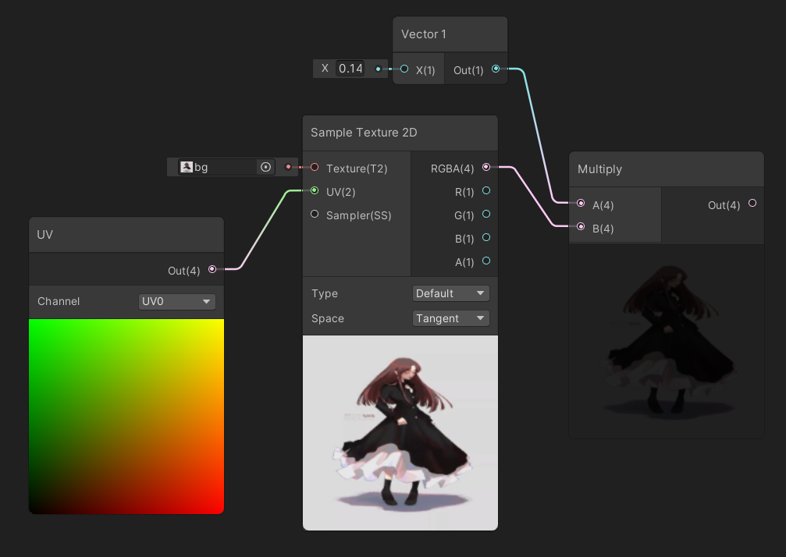

接着，加上左上角的颜色，对应的shader代码如下：
```h
// 左上
color += tex2D(_MainTex, float2(uv.x - offset, uv.y - offset)) * 0.0947416f;
```

要有一个offset变量，新建一个Vector1类型的变量，如下   
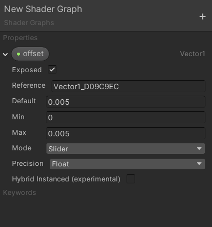

要对uv的x、y做offset偏移，即：uv.x - offset, uv.y - offset，使用Split节点将uv的x、y分量分离，分别进行运行：  
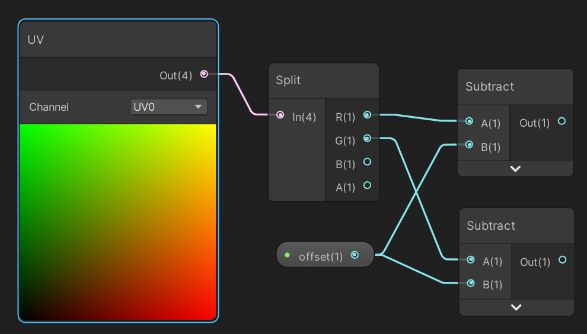


接着将两个分量合成一个float2，即：float2(uv.x - offset, uv.y - offset)，使用Combine节点将两个分量合在一起：  
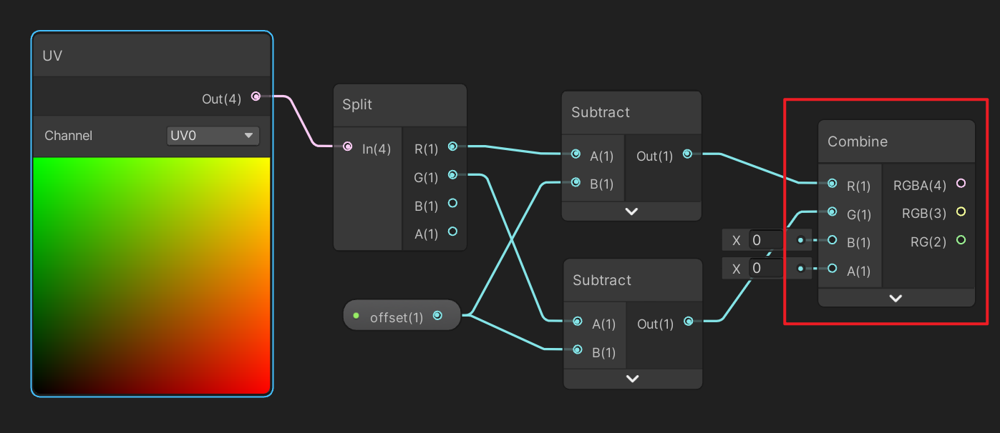

再接着是使用该uv对图片进行采样，即：tex2D(_MainTex, float2(uv.x - offset, uv.y - offset))，使用Sample Texture 2D节点：  
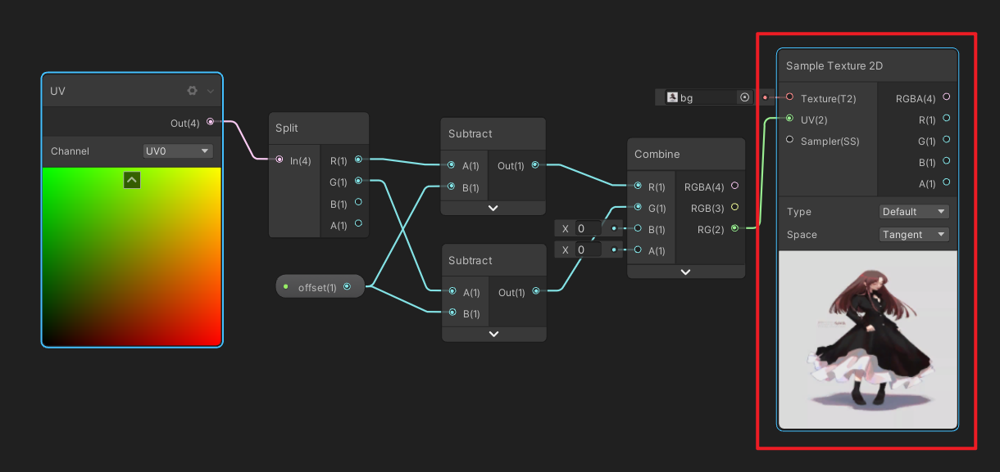

再乘以系数0.0947416，即：tex2D(_MainTex, float2(uv.x - offset, uv.y - offset)) * 0.0947416f;   
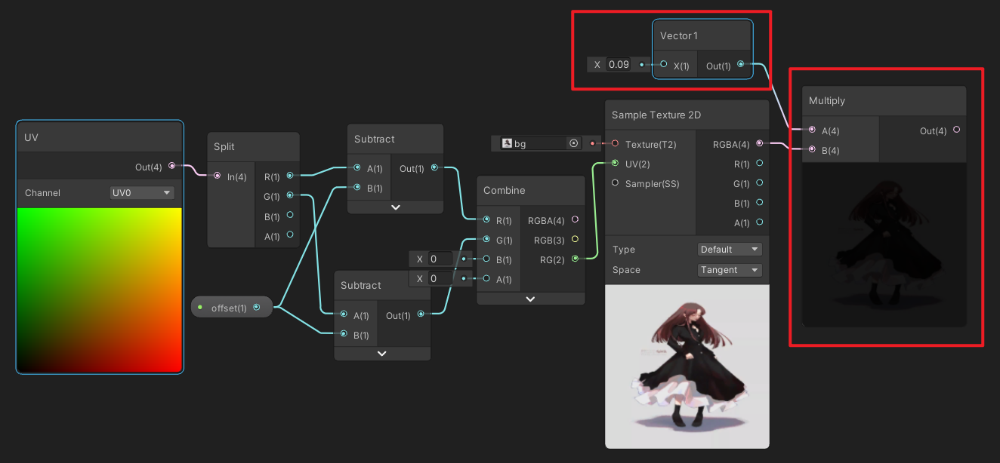

最后与第一步得到的颜色进行+=操作  
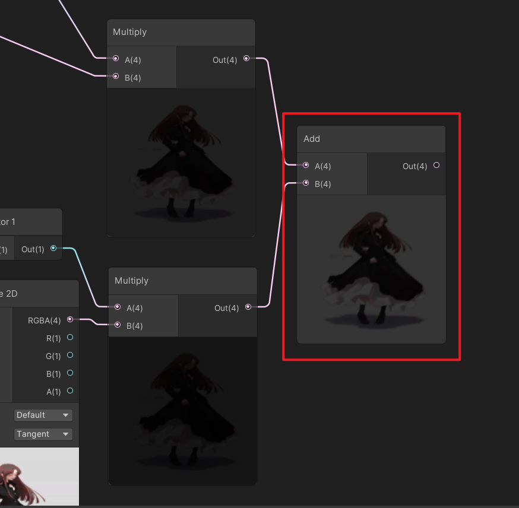

这样以此类推，实现上、右上、左、右、左下、下、右下逻辑。  
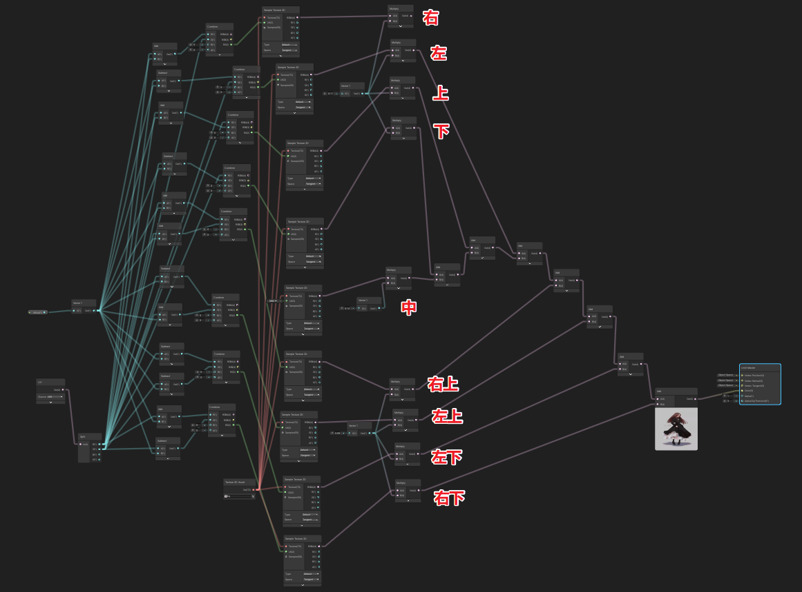

效果测试：  
offset为0的时候，  
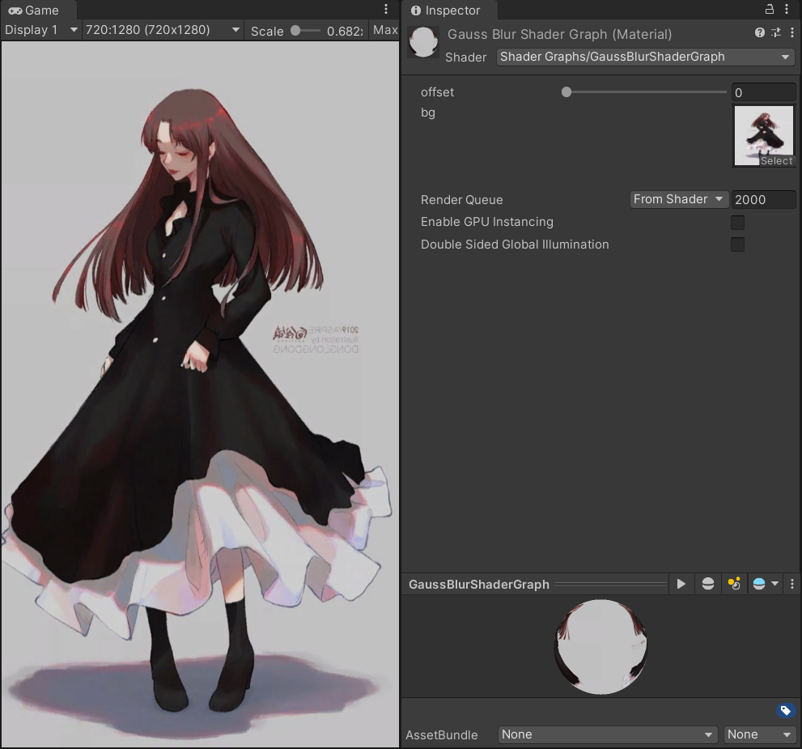

调整offset  


