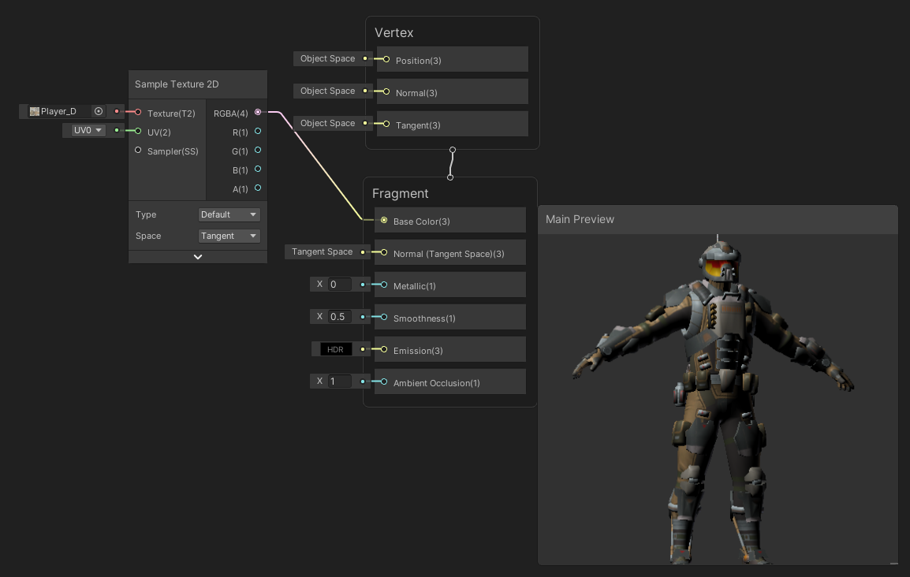
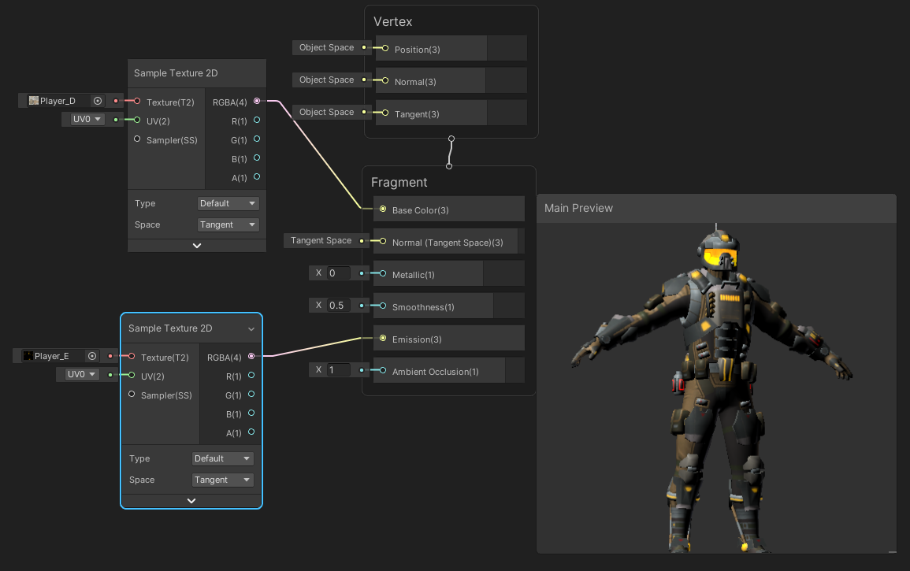
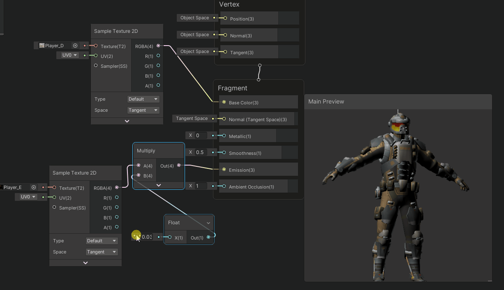
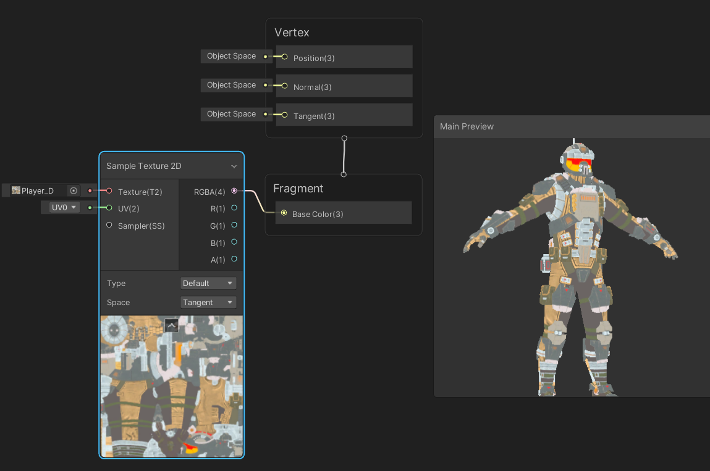
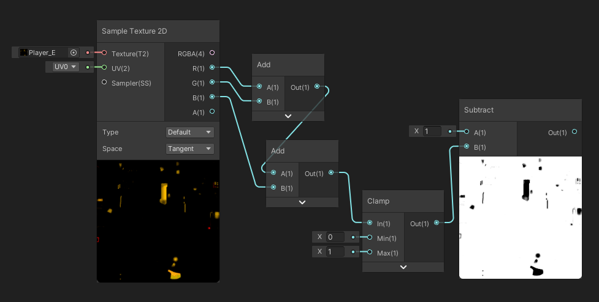
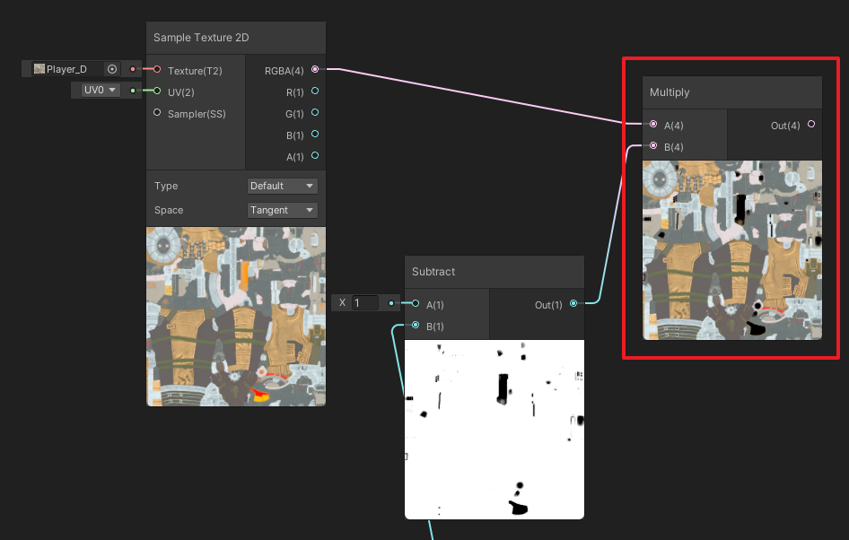
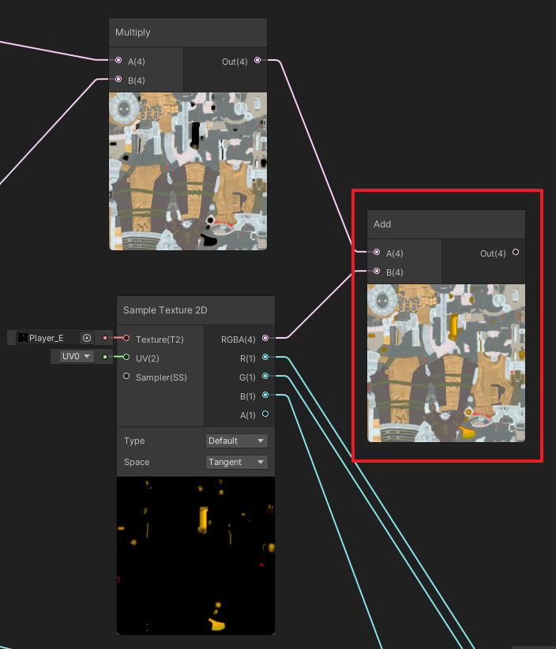
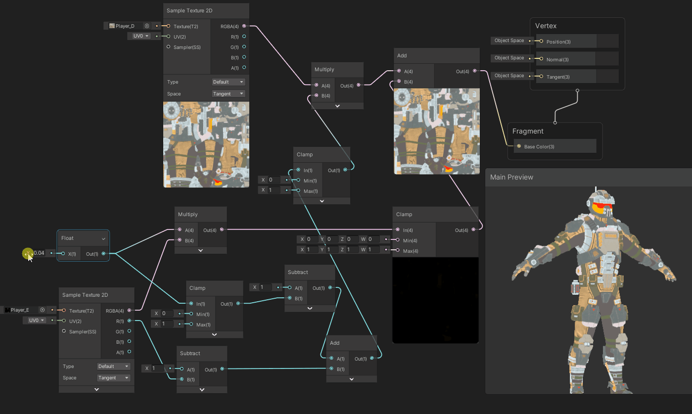

## 19、自发光
具体实现参见这篇文章：[Unity Unlit ShaderGraph实现与PBR的自发光贴图类似的叠加效果](https://linxinfa.blog.csdn.net/article/details/112251435)

## PBR ShaderGraph中的自发光
我们先看下PBR ShaderGraph（Lit ShaderGraph）下的自发光效果。
没有自发光效果是这样的：

使用自发光贴图，输入到Emmision，有了自发光效果：

我们可以对自发光贴图做个乘法，方便调整自发光强度：

## Unlit ShaderGraph中的自发光
我们来看看Unlit ShaderGraph是怎样的。
在Unlit ShaderGraph，没有Emission的输入，所以我们不能很方便得添加自发光效果。

### 1、简单的加操作实现自发光
如果将自发光贴图与Base Color做一个简单的加法，效果如下：  

### 2、优化版
根据需求，是想要在基础色上层显示自发光颜色，而不是简单的加操作。也就是说，自发光的部位，不能有基础色。
按照这个思路，我们先对发光贴图做一个处理，即得到发光贴图的黑白反色图。

使用这张黑白反色图，与基础色进行相乘，即可将基础色中发光的部位的颜色滤掉。

然后再与发光贴图做一个加法操作，这样，发光的部位就是自发光贴图的纯颜色了。

加上自发光强度控制，当自发光越来越弱的时候，要渐渐显示回基础色。
最终节点如下：

