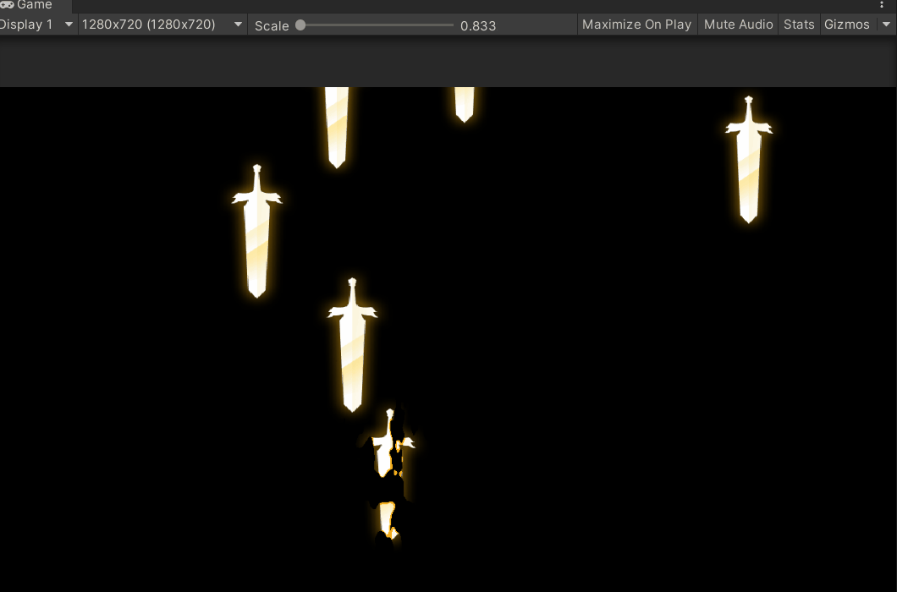
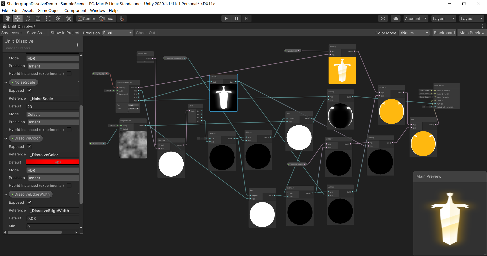
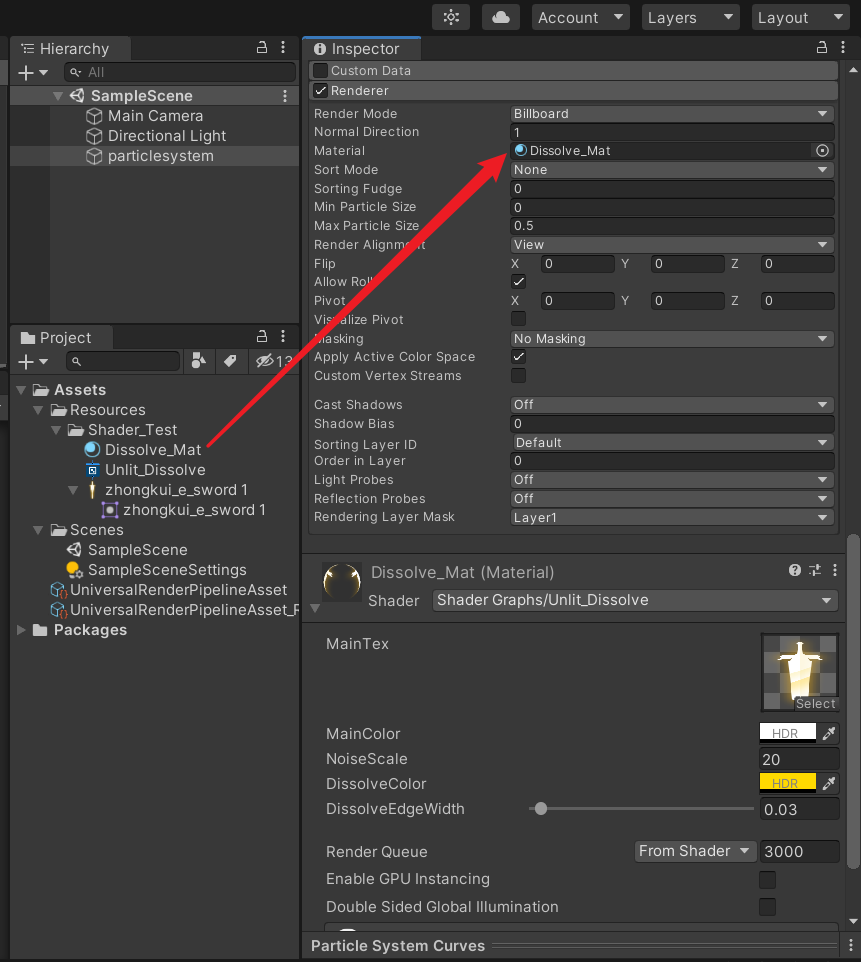
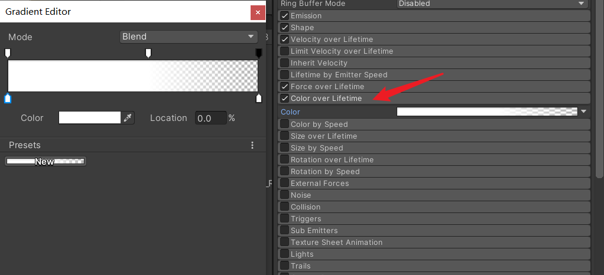
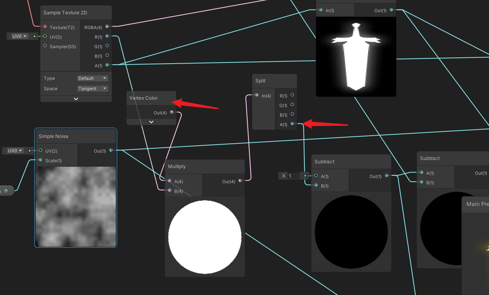

## 20、粒子系统溶解效果
具体实现参见这篇文章：[Unity ShaderGraph溶解效果运用到粒子系统中](https://linxinfa.blog.csdn.net/article/details/112549856)

最后弄出来的ShaderGraph连线图如下

将ShaderGraph赋值给Dissolve_Mat材质球，再将材质球赋值给粒子的Material。

运行效果

## 实现原理
主要是利用粒子的顶点色的alpha通道来控制溶解。

