## 21、物体靠近局部溶解效果
具体实现参见这篇文章：[Unity使用ShaderGraph实现根据坐标控制溶解的位置，物体靠近局部溶解](https://linxinfa.blog.csdn.net/article/details/112555890)

ShaderGraph最终连线图如下

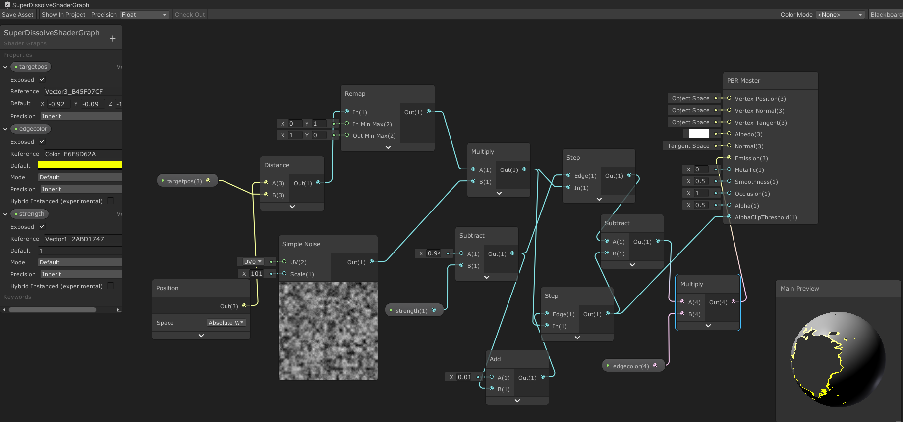

### 实现原理
#### 1 ShaderGraph部分
溶解的原理就是利用AlphaClip属性，当AlphaClip的值比Alpha的值大时，则会不显示。

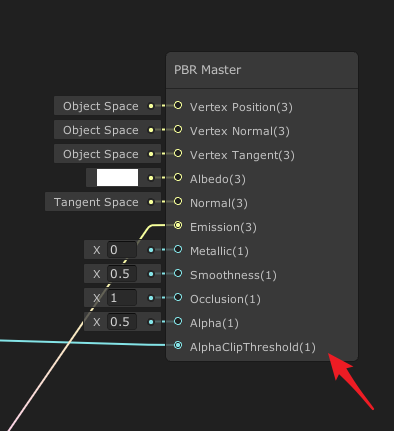

我们利用一个噪声来作为AlphaClip的输入即可实现溶解的效果。
然后想要根据坐标来控制溶解的范围，比如物体靠近的时候，靠近的位置有溶解的效果，这个怎么做呢？
我们首先暴露一个Vector 3属性：targetpos，它作为目标位置，

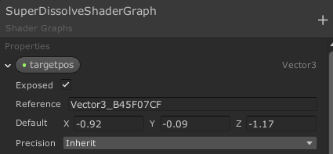

我们要计算这个目标位置距离我们要溶解的模型的顶点坐标的距离，那我们就要知道模型自身的顶点坐标，要用到Position节点，Space选择Absolute World，

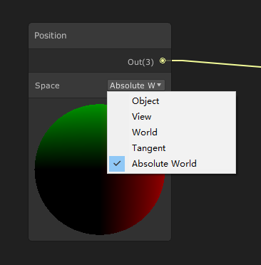

有了顶点坐标和targetpos，就可以计算距离了，使用Distance节点。

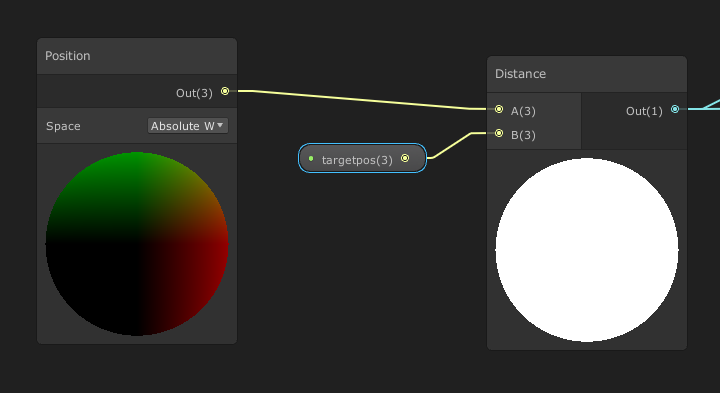

我们要的效果是距离近则溶解，而要溶解需要使AlphaClip大于Alpha，也就是说，也就是说距离近要输出更大的值，距离远输出更小的值，所以我们使用Remap将Distance的输出做一个映射。

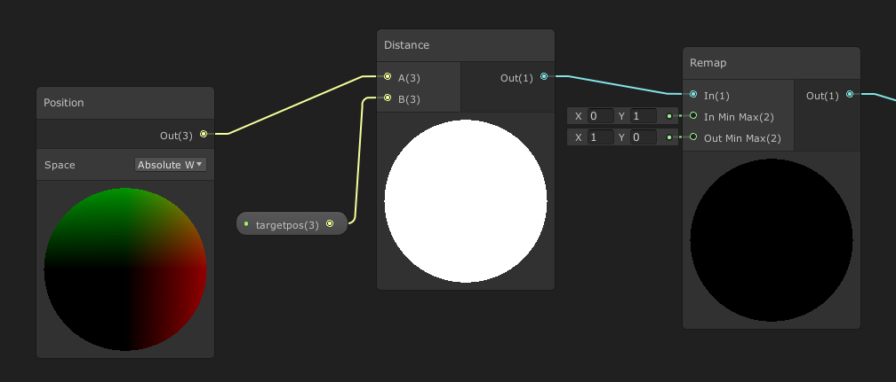

然后将将Remap的输出与噪声相乘，这样就可以根据距离来控制噪声的范围。

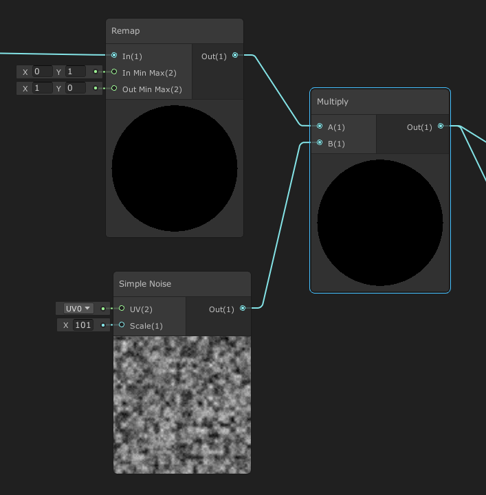

再接着，就是利用相乘后的输出（一个带范围的噪声）作为AlphaClip的输入了，为了实现一个溶解边缘光的效果，通过两个Step做差即可，连线图如下。

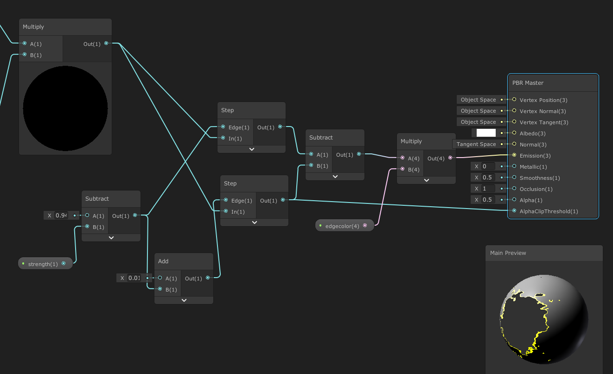

#### 2 材质球
创建材质球，将上面的ShaderGraph赋值给材质球。

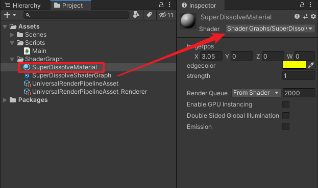

#### 3 将材质球赋值给模型
创建一个Sphere球体，将材质赋值给它。

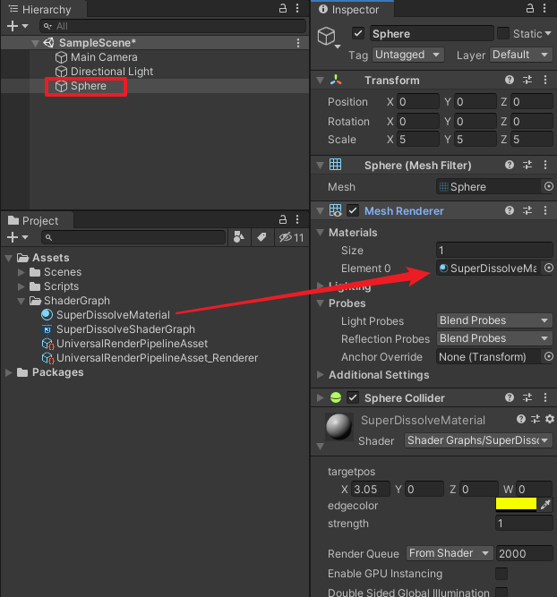

再创建一个Sphere2，用来靠近Sphere。

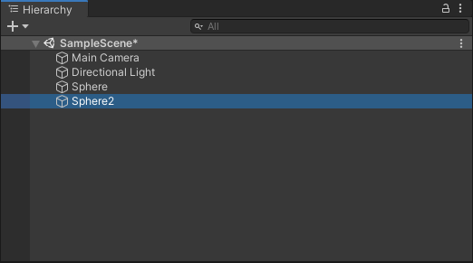

#### 4 C#脚本控制材质球参数

创建一个C#脚本：Main.cs，用来控制材质球的参数。
```C#
using UnityEngine;

/// <summary>
/// 该脚本挂在要溶解的物体上
/// </summary>
public class Main : MonoBehaviour
{
    /// <summary>
    /// 材质球
    /// </summary>
    public Material mat;
    /// <summary>
    /// 要靠近过来的物体
    /// </summary>
    public Transform m_targetObj;


    // Update is called once per frame
    void Update()
    {
        mat.SetVector("Vector3_B45F07CF", m_targetObj.position);
    }
}

```

将Main.cs脚本挂到Sphere球体上，赋值对应的public变量。

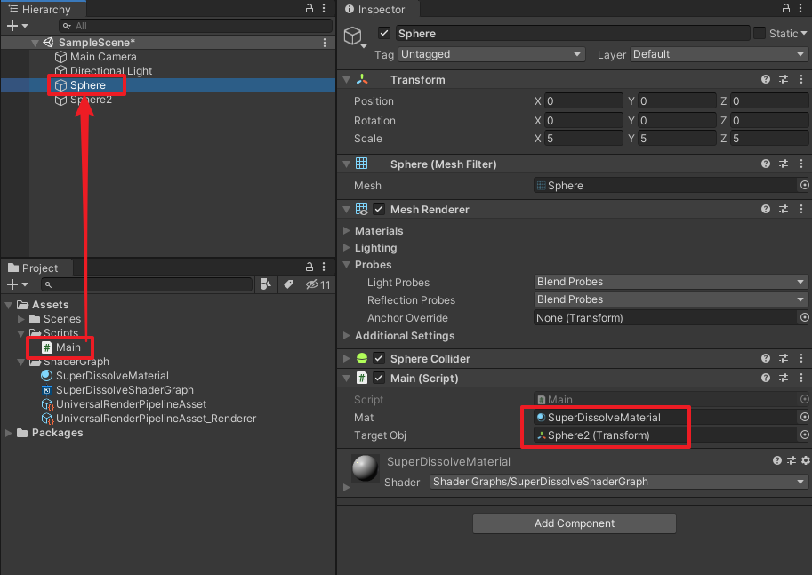


### 四、运行测试
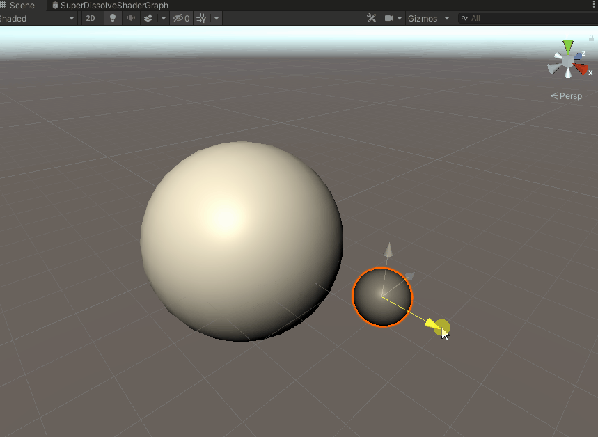

可以调节strength属性来修改溶解强度

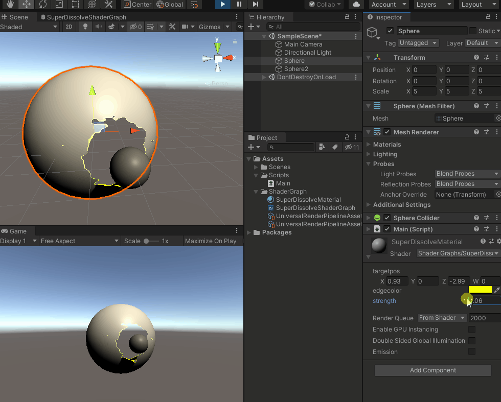

### 五、答疑

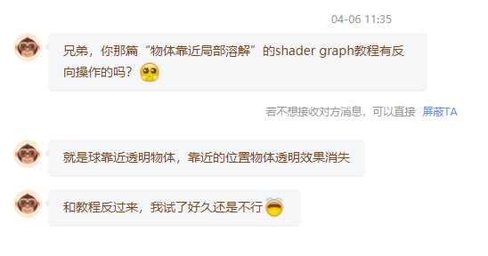

其实很简单，只需调整下如下几个地方，

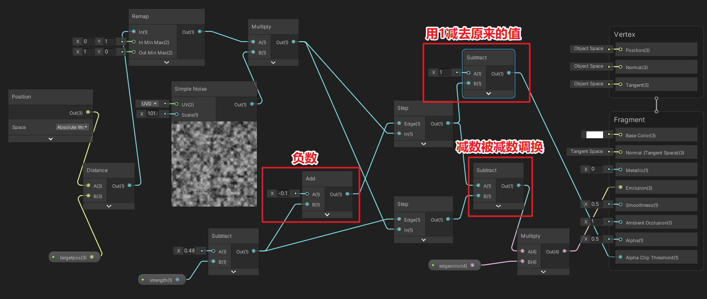

运行效果如下：（注：这次我用的是Unity 2020.2.7f1c1，光照效果与Unity 2019有所差异）
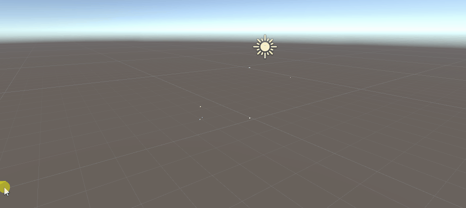