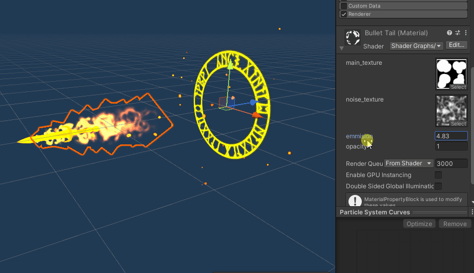
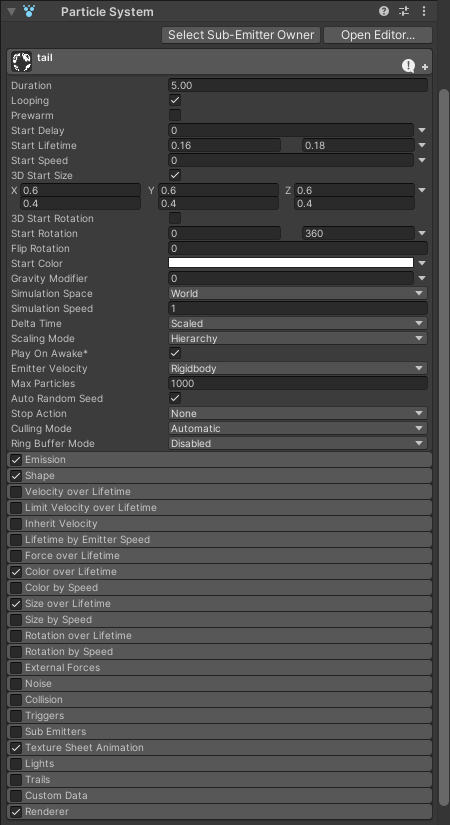
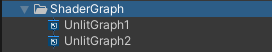
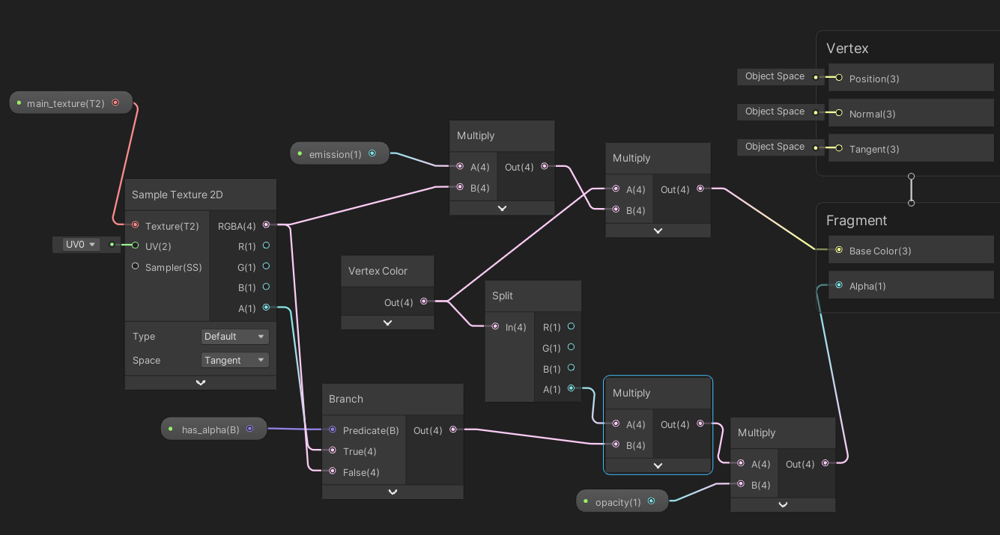
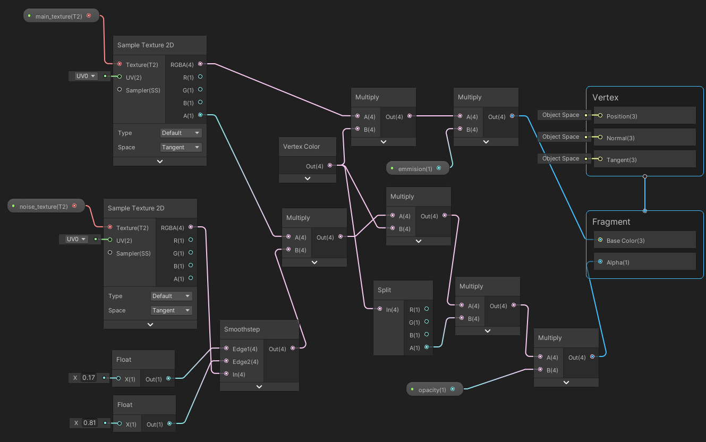

## 23、子弹拖尾效果
具体实现参见这篇文章：[Unity使用ShaderGraph配合粒子系统，制作子弹拖尾特效](https://linxinfa.blog.csdn.net/article/details/114822797)

Demo工程已上传到GitHub，感兴趣的同学可自行下载学习。`未导出 2019 工程版本`

GitHub地址：https://github.com/linxinfa/UnityShaderGraphCoolBullet

### 二、实现原理
原理不难，主要是在ShaderGraph中利用粒子的顶点色，配合贴图的RGBA进行运算最后输出，把参数属性暴露出来供外部调整。

核心还是粒子本身的设置，比如喷射速度、颜色随时间的变化、大小随时间的变化、旋转角度随时间的变化等等，具体参数可下载Demo工程进行学习。

### 三、ShaderGraph
制作的两个ShaderGraph文件如下，（图片看不大清的话，可下载Demo工程进行学习）：

UnlitGraph1：

UnlitGraph2：

### 四、图片素材

