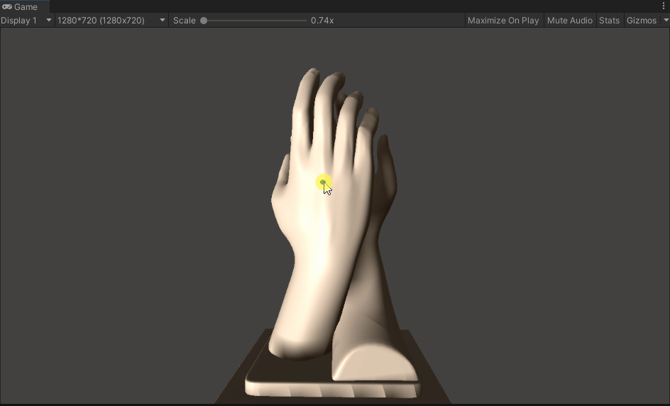
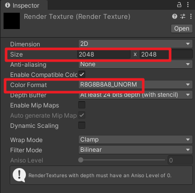
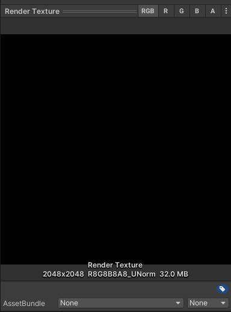
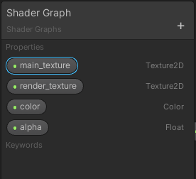
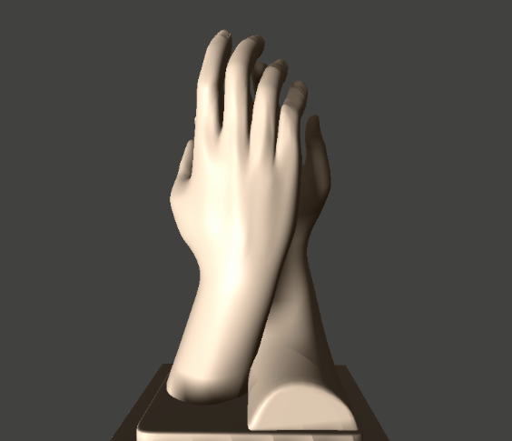
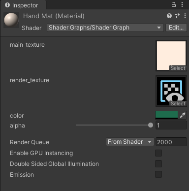
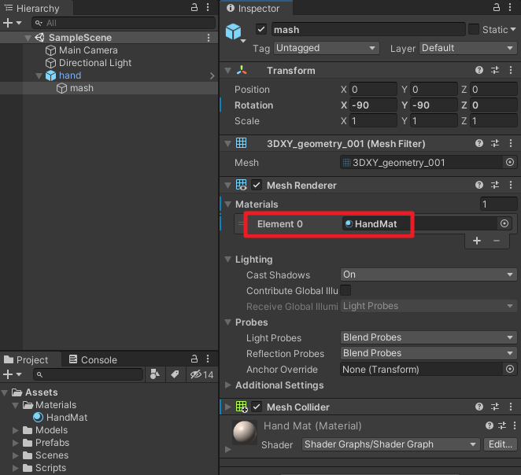
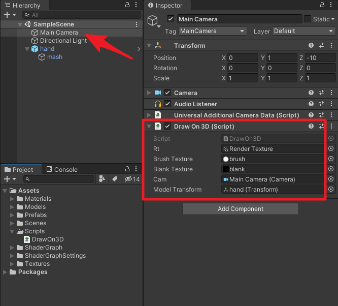
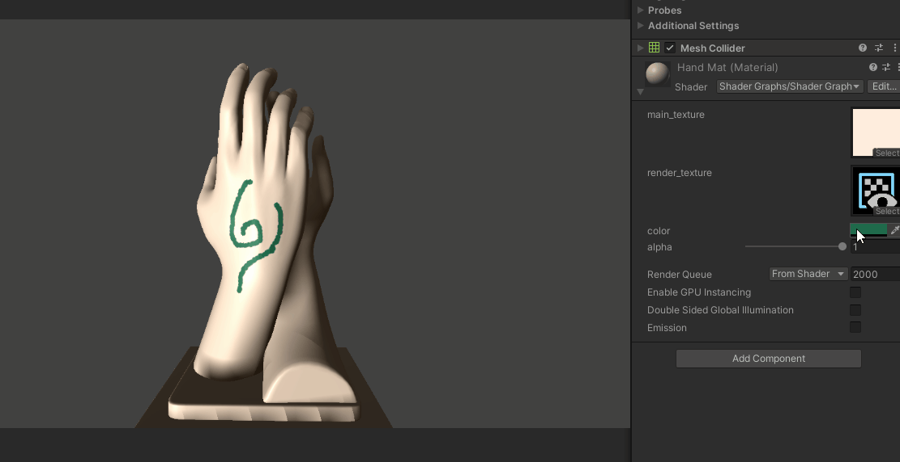

## 24、在模型上涂鸦
具体实现参见我这篇文章：[使用Unity ShaderGraph实现在模型涂鸦的效果](https://linxinfa.blog.csdn.net/article/details/114951109)

本文Demo工程已上传到CodeChina（最近GitHub貌似有问题，经常连不上），感兴趣的同学可自行下载学习。
[CodeChina地址](https://codechina.csdn.net/linxinfa/UnityShaderGraphGraffiti)

注意，我使用的Unity版本是2020.2.7f1c1，ShaderGraph版本是Version 10.3.2 - March 01, 2021，如果你使用的版本比我的版本低，则可能运行我的Demo工程会有问题。

### 二、思考
首先，我们思考一下，实现这个功能需要解决的问题：
1. 我们怎么知道鼠标点击在模型上的具体位置？
2. 我们怎么在这个位置画笔刷图案？
3. 我们画的图案如何与模型的主贴图融合？

第一个问题，我们可以利用摄像机射线碰撞检测来获取鼠标点击到模型上的具体位置。
用到`Camera.ScreenPointToRay`和`Physics.Raycast`接口。

第二个问题，我们可以把鼠标画的点画在一张RenderTexture上，
基于第一个问题答案，我们可以得到射线碰撞检测的RaycastHit，而RaycastHit有一个textureCoord成员变量，这个就是uv坐标，有了uv值，就可以换算出在RenderTexture图上的具体位置，再使用`Graphics.DrawTexture`接口在RenderTexture上画笔刷图案即可。

第三个问题，两张图片的融合，这就交给ShaderGraph来处理吧。

所以，其实这个功能的核心不是ShaderGraph，ShaderGraph只是做最后的图片融合处理。
当然，这只是其中一种思路，如果各位大佬有更好的方法，欢迎指出。

### 三、实操
#### 1、Render Texture
首先，创建一个Render Texture。

设置一下Render Texture的尺寸和格式，尺寸的大小决定我们最后画图案的精度。

我们可以看到，Render Texture默认是黑乎乎的一张图。

#### 2、笔刷图案
用photoshop做两张图，一张纯黑色的方图（用于初始化填充Render Texture），一张笔刷图，简单起见，笔刷图案我就用一个白点。
如下：

#### 3、写脚本：DrawOn3D.cs
开始写代码，就一个脚本：DrawOn3D.cs。代码的注释我写得比较清晰了，大家应该能看懂。
代码如下：

#### 4、ShaderGraph
创建一个PBR ShaderGraph，实现模型主贴图和RenderTexture的融合。

暴露出四个变量，方便在材质球中设置参数。

#### 5、模型
为了体现我的艺术天分，我找了个手模。

#### 6、材质球
创建一个材质球HandMat，使用上面做的ShaderGraph，给材质球赋值贴图。

最后将材质赋给模型。

#### 7、挂脚本
将`DrawOn3D`脚本挂到`Main Camera`上，并设置好参数。
`Rt`：Render Texture，用于画图案；
`Brush Texture`：笔刷图案，一个白点；
`Blank Texture`：一张纯黑色的空白图；
`Cam`：主摄像机，用于做射线检测；
`Module Transform`：用于旋转模型。

### 四、运行测试
运行Unity，测试效果如下：

可以通过材质球调节图案颜色和透明度。

