## 25、刮刮乐效果
具体实现参见这篇文章：[使用Unity ShaderGraph实现刮刮乐的刮卡剔除效果](https://linxinfa.blog.csdn.net/article/details/114982162)

本文最终效果如下：

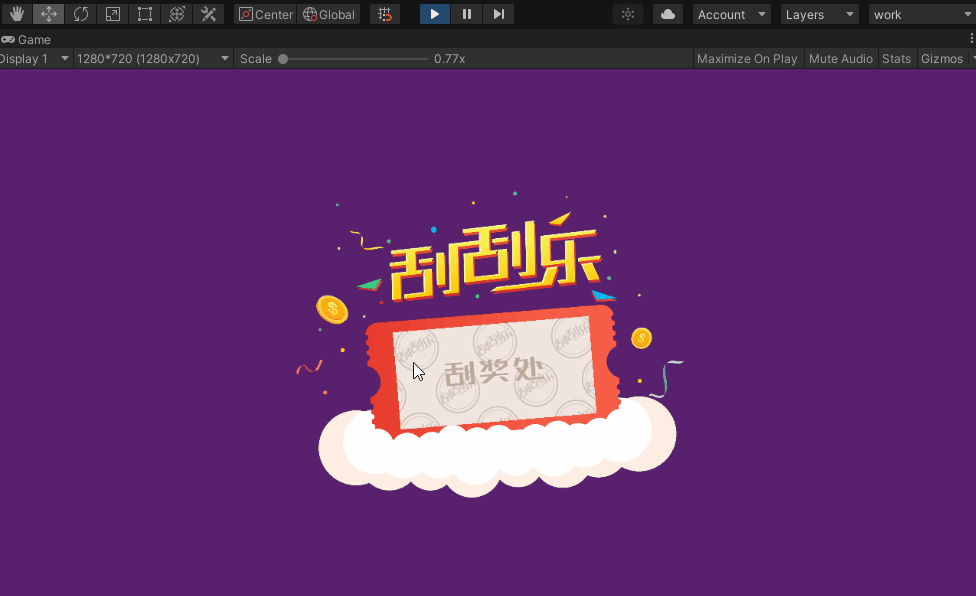

本文Demo工程已上传到CodeChina（最近GitHub貌似有问题，经常连不上），感兴趣的同学可自行下载学习。
[CodeChina地址](https://codechina.csdn.net/linxinfa/UnityShaderGraphScratchTicket)

注意，我使用的Unity版本是2020.2.7f1c1，ShaderGraph版本是Version 10.3.2 - March 01, 2021，如果你使用的版本比我的版本低，则可能运行我的Demo工程会有问题。

### 二、原理
原理就是利用Alpha通道，Alpha为0时透明，我们可以使用一张RenderTexture作为Alpha通道图，与UI的主贴图的Alpha通道图相乘即可。
根据鼠标刮的位置，在RenderTexture上对应的位置画笔刷印记即可。

### 三、实操
#### 1、RenderTexture
首先，创建一个Render Texture。

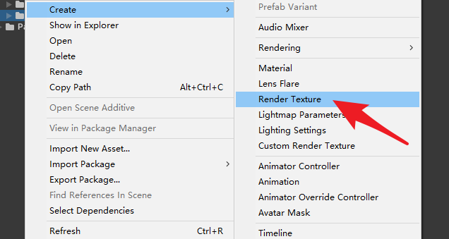

设置一下Render Texture的尺寸和格式。

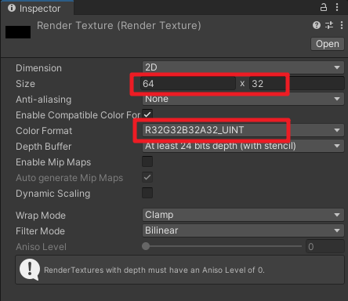

#### 2、笔刷图案

用photoshop做两张图，一张纯黑色的方图（用于初始化填充Render Texture），一张笔刷图，简单起见，笔刷图案我就用一个白点。
如下：

#### 3、写脚本：ScratchUI.cs
开始写代码，就一个脚本：Script_5_24.cs。代码的注释我写得比较清晰了，大家应该能看懂。

代码如下在 `Script_5_24`

#### 4、ShaderGraph
创建一个Unlit ShaderGraph，实现UI主贴图的Alpha通道与和RenderTexture的相乘。

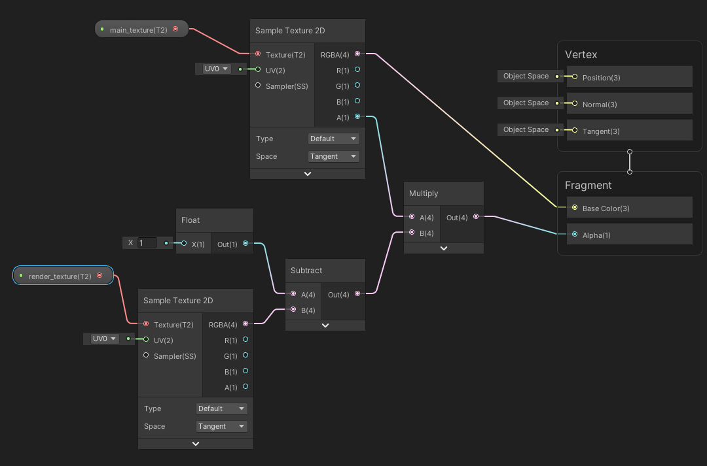

注意Graph Settings设置Surface为Transparent，Blend设置为Alpha。

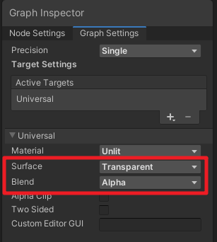

暴露出两个变量，方便在材质球中设置参数。

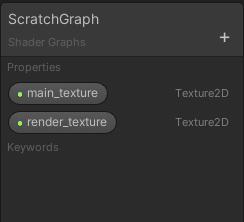

#### 5、UI制作
准备刮刮乐的UI图片，导入Unity中。

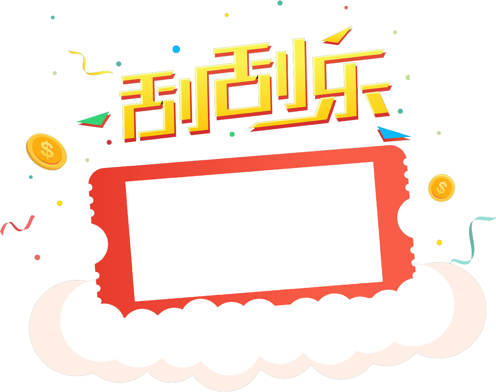

拼成界面，如下。mask层就是要被刮掉的层。

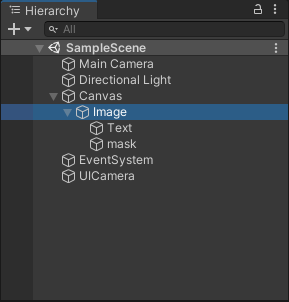

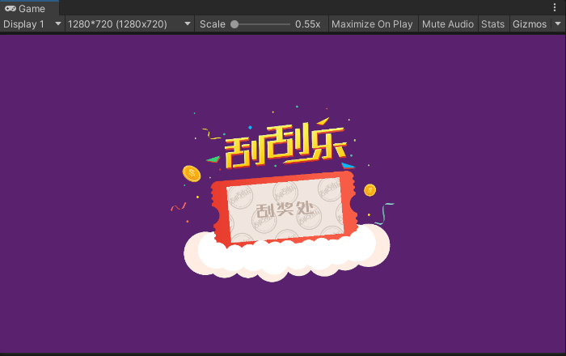

#### 6、材质球
创建一个材质球ScratchMaterial，使用上面做的ShaderGraph，给材质球赋值贴图。

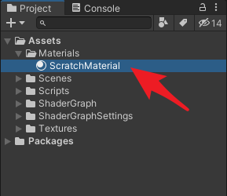

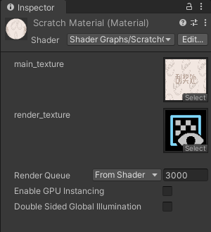

最后将材质赋给mask的Material。

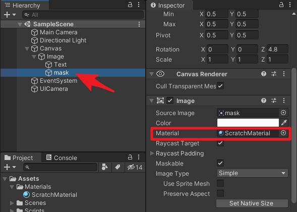

#### 7、挂脚本

将`ScratchUI.cs`脚本挂到mask上，并设置好参数。
`RenderTexture`：用于Alpha通道图；
`Brush Texture`：笔刷图案，一个白点；
`Blank Texture`：一张纯黑色的空白图；
`RectTransform`：mask的RectTransform，用于坐标转换；
`Canvas`：用于坐标转换。

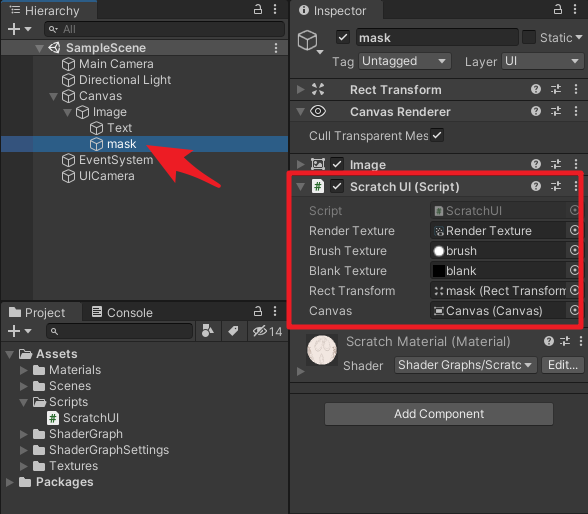

### 四、运行测试