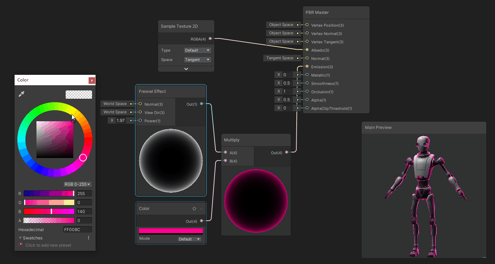
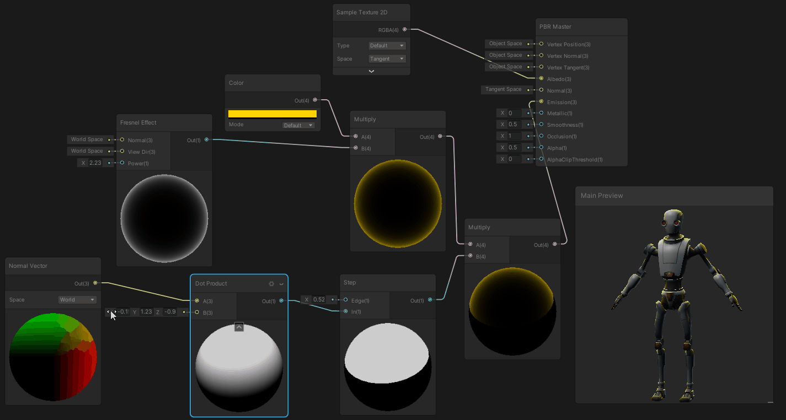

## 3、模型裁切，主要节点、Position、AlphaClip
边缘光效果，主要节点：Fresnel Effect

原理：Fresnel Effect，菲涅耳效应，根据观察角度产生不同反射率从而对表面效果产生影响，当你靠近时，会反射更多的光。菲涅耳效应节点通过计算表面法线与视线方向的夹角来近似。这个角度越大，返回值越大。这种效果经常被用来实现边缘照明，这在很多艺术风格中都很常见。

进阶：带方向的菲涅尔边缘光效果

