# 四、ShaderGraph入门：PBR Graph的简单使用
[1、创建PBR Graph](#1创建pbr-graph)  
[2、创建一个颜色变量](#2创建一个颜色变量)  
[3、将Color变量连到Master节点中](#3将color变量连到master节点中)  
[4、保存ShaderGraph文件](#4保存shadergraph文件)  
[5、将ShaderGraph赋值给Material材质球](#5将shadergraph赋值给material材质球)  
[6、将材质球赋值给3D模型](6、将材质球赋值给3D模型)  

## 1、创建PBR Graph
在Project窗口中`右键-Create-Shader-PBR Graph`，即可创建一个`PBR Graph`脚本。  
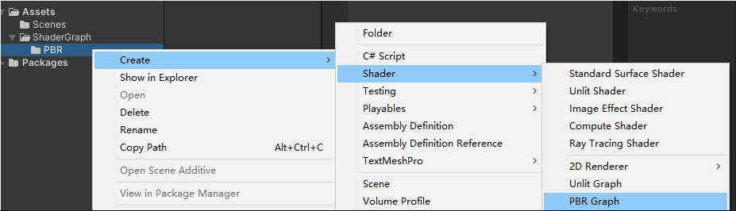

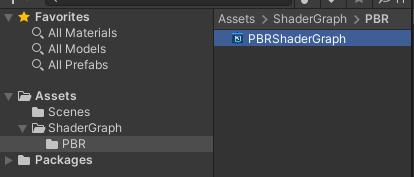

双击`PBRShaderGraph`文件，即可打开编辑窗口

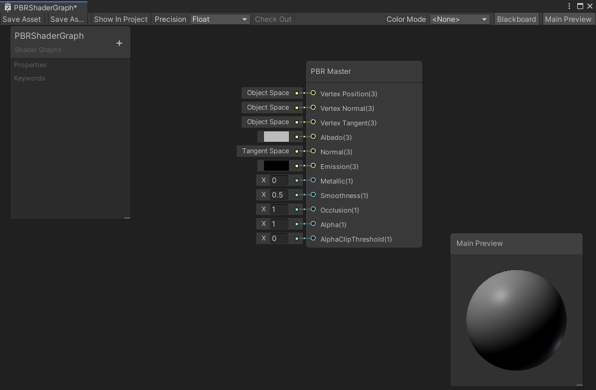
## 2、创建一个颜色变量
点击左上角的属性窗口中的+号可以创建变量，这里我们创建一个Color变量。

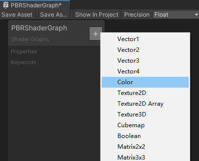

如下，出现了一个Color变量，我们可以设置默认颜色，如下设置了红色

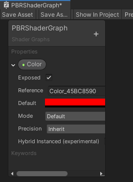
## 3、将Color变量连到Master节点中
将变量拖动到操作区中  
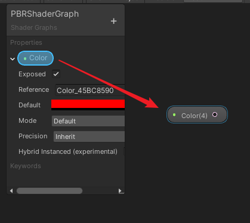

将Color节点连到PBR Master节点的Albedo插槽中，即可看到预览窗口中的模型的表面已变成了红色。

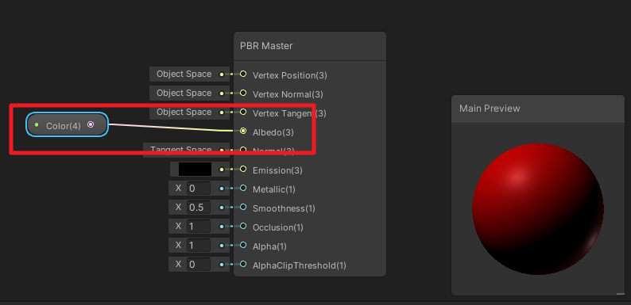
## 4、保存ShaderGraph文件
点击Save Asset即可保存ShaderGraph文件。  
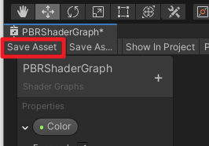

## 5、将ShaderGraph赋值给Material材质球
创建一个Material材质球：PBRTestMaterial，然后直接将ShaderGraph文件拖动到材质球文件上即可。

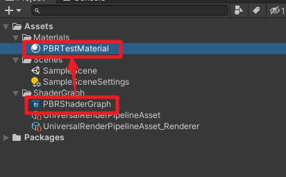

材质球上，可以看到我们在ShaderGraph中创建的Color变量，通过变量可以调整材质球的颜色。

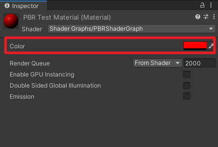

## 6、将材质球赋值给3D模型
在Hierachy窗口中`右键 - 3D Object - Capsule`，创建衣蛾胶囊体模型

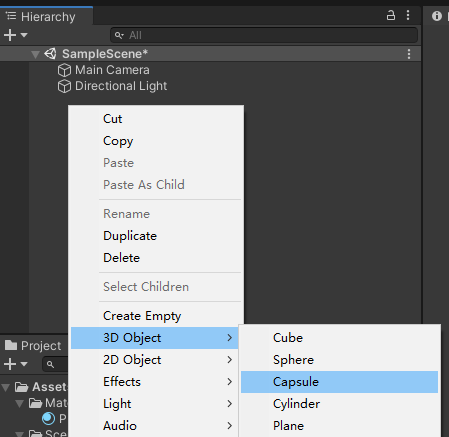

将材质球赋值给胶囊体的材质属性中，即可看到胶囊体变成了红色

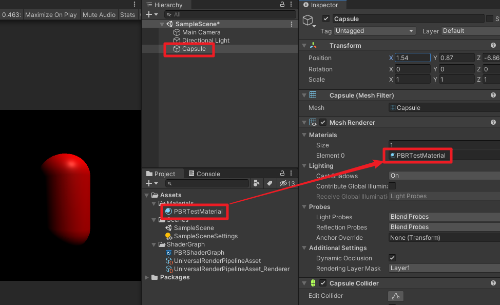

调整材质球的Color变量，胶囊体的颜色也相应的发生变化。

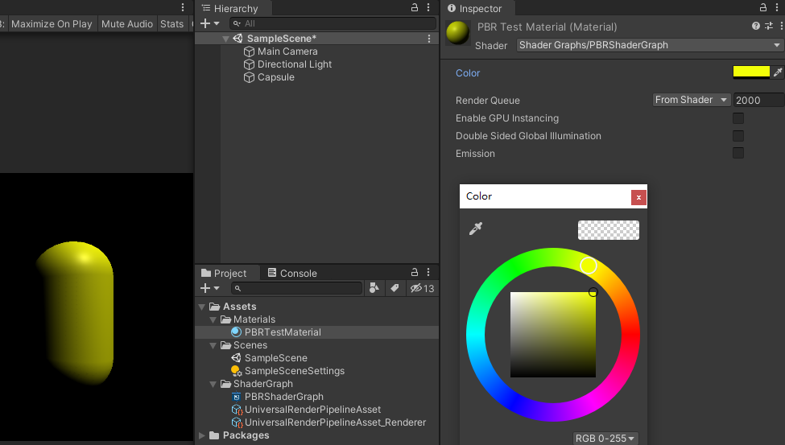